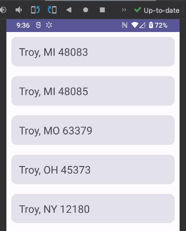

# Jetpack Compose Multi-Module Clean Architecture

This is a port of my [City Api Client](https://github.com/santansarah/city-api-client) to model the
Perry Street Software pattern: https://github.com/perrystreetsoftware/DemoAppAndroid

## Understanding the Data Flow (Api -> Repository -> ViewModel) the RxJava Way

> Note: For simplicity, I'm leaving out Use Case/Logic layer for now.

DRAFT * DRAFT * DRAFT

1. API calls return:
    * Observable - Very similar to Kotlin cold flow. Used for emitting streams of data over
      time whose state you want to track. Good for collections and lists. Will only emit when a
      observer is subscribed.
    * Completable - This has no value; it only emits Completed or Error. Good for one-off things that
      return no value & for setting state - like setting a favorite, liking something, etc.
    * Single - Emits one successful value or an error. This is good for pulling up detail
      items, like a single ToDo item, or a City Result, etc. Similar to a StateFlow/MutableStateFlow.

   Each API call is set to start in the IO thread: `Schedulers.io()`. Calls are also deferred, which
   means that values aren't emitted until someone subscribes. This gives each subscriber their own
   flow of data, independent of other subscribers. Flows will be repeated - NOT hot, for new
   subscribers.

2. Now, we want to call this API from our repositories. Repositories can be:
    * Pull - synchronous-like iterator pattern, where the data source would need to be polled to
      get any changes. So if we added or changed data, we need code to manually check for this. Good
      for getting some type of detail that's not going to actively change. Returns a Single: 1 value
      or an error.
    * Push - This is an active, steady stream of data that's sent off to the subscriber and triggers
      new state changes. To do this, the repo uses a BehaviorSubject that requires an initial
      value and emits the current value to new subscribers. When an observer subscribes to a
      BehaviorSubject, it gets the default value if nothing is emitted, the most recent value if all
      is good, or an error if something goes wrong. The BehaviorSubject here is derived from an
      Observable - not a Single.

Let's go even deeper, and compare different RxJava patterns to Kotlin Flows.

<table>
<tr><td>Kotlin</td><td>RxJava</td></tr>
<tr><td><b>Flow:</b> Emits asynchronous data stream, automatically uses coroutine scopes in the 
background to flow or cancel with lifecycle: activity, view model, etc. or we can explicitly define the lifecycle scope, automatic backpressure
support w/suspending coroutines, or we can add our own strategies with buffers, conflate, and collecting latest values, starts separately for
each collector, converts to hot flow w/statein + sharein</td>
<td><b>Observable:</b> Emits asynchronous data stream, to handle backpressure use Flowable, 
must control lifecycle w/Disposable, starts separately for
each collector, can use ConnectableObservable & .publish() to create hot flow
</td></tr>
<tr><td><b>SharedFlow/MutableSharedFlow:</b> One multicast stream starts emitting even if there are no subscribers, available for multiple subscribers. Supports
a replay cache for new subscribers. Sharing strategy can help control lifecycle. Doesn't need
a default value</td>
<td><b>PublishSubject:</b> One multicast stream starts emitting even if there are no subscribers, available for multiple subscribers. Does NOT support a
replay cache for new subscribers - a new Observer won't receive any past items. Doesn't need
a default value</td>
</tr>
<tr><td><b>StateFlow/MutableStateFlow:</b> must have initial default value, emits one value to subscribers,
auto replay of 1</td>
<td><b>BehaviorSubject:</b> must have initial default value, emits one value to subscribers, 
auto replay of 1</td></tr>
</table>

For RxJava **Single:** a flow of 1 item or an error, there is no direct relationship, but you could 
easily create any type of flow that returns a wrapper Resource class (Success/Error), catch errors
in your flow collection, etc. Single reminds me of StateFlow or mutableStateOf. 

The same goes for **Completable** - you could just return a sealed (Success/Error) class.

### View Model Patterns

Consider the following, like we'd do with Kotlin Flows to get our UI State:

```kotlin
private val _uiState = MutableStateFlow(UiState())
val uiState: StateFlow<UiState> = _uiState.asStateFlow()
```

Now, for RxJava, we do this instead:

```kotlin
private val _state: BehaviorSubject<UiState> = BehaviorSubject.createDefault(UiState())
val state: Observable<UiState> = _state
```

Easy right? After that though, things get tricky. With Kotlin Flows, they will flow and
cancel with the lifecycle of our ViewModel. But with RxJava, it's not that simple. In the ViewModel,
we need to manage the lifecycle ourselves with something like this:

```kotlin
private fun onPageLoaded() {
   disposables.add(repo.cities.doOnNext {
      _state.onNext(_state.value!!.copy(cities = it))
   }.subscribe())

   disposables.add(
      repo.reload()
         .doOnSubscribe {
            _state.onNext(_state.value!!.copy(isLoading = true))
         }
         .subscribe({
            _state.onNext(_state.value!!.copy(isLoading = false, isLoaded = true))
         }, { error ->
            _state.onNext(_state.value!!.copy(
               isLoading = false,
               isLoaded = true,
               error = (error as AppErrors)
            ))
         })
   )
}
```

Let's break this down. First, we call our BehaviorSubject `cities` from the repo, update the ViewModel UI State, add this to a disposable, and subcribe to the flow.

Next, our `reload` fun is Completable, but our list of cities is Observable. This is a little 
confusing - but what we're doing here is from the repo, `reload` populates `cities`. While this is 
happening, we want to update the UI State: first, we're loading, then when we `subscribe`, we push 
the flow with `doOnNext` and then we're finished. Also, we want to track it in `disposables`.

Now, when the ViewModel gets cleared, we can clean things up. Kotlin flows & coroutines do this for us automatically:

```kotlin
override fun onCleared() {
   super.onCleared()

   disposables.dispose()
}
```

On the plus side, testing is much easier! We don't have to use `turbine` or complicated channels
to test our UI data stream.

Here's what our state looks like in 3 iterations, which we can easily observe in our Test:

```command
values array: 
UiState(cities=[], isLoading=true, isLoaded=false, error=null), 
UiState(cities=[City(city=Troy, state=OH), City(city=Troy, state=NY)], 
        isLoading=true, isLoaded=false, error=null)
UiState(cities=[City(city=Troy, state=OH), City(city=Troy, state=NY)], 
        isLoading=false, isLoaded=true, error=null)
```

## First Passing Test at DTO layer:


## Second Passing Test at Repository Layer:


## Third Passing Test at View Model:


## Final Working Demo End-to-End

